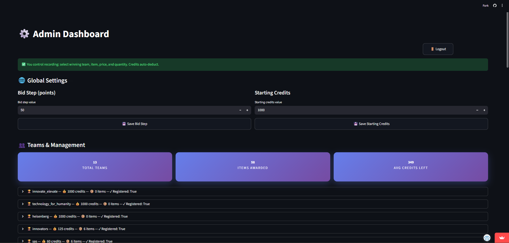

<div align="center">

# 🏗️ Bid2Build

A real-time auction management platform built for IEEE events where teams compete for hardware components using limited credits.

[](https://streamlit.io)
[](https://python.org)

---
</div>
<div align="center">

**🚀 Live Demo**  
https://drive.google.com/drive/folders/1SB8NMxIlMlNpMiPQn5TPIIZOGed_LFc0?usp=sharing  

**🌐 Deployed Website**  
https://bid2build.streamlit.app/

</div>

## 🎯 What is Bid2Build?

Bid2Build is a web platform that manages live technical auctions during team-based hackathons and engineering events. Instead of giving everyone the same components, teams strategically bid for hardware using limited credits.

The platform tracks everything in real-time:
- 💰 Team credits and spending
- 🔧 Component ownership
- 📊 Live auction history
- ✅ Instant error correction

Built for an IEEE Signal Processing Society event and tested under real competition conditions.

---

## 🌟 Why This Exists

As an IEEE organizer, I faced a problem: **How do you track dozens of components across multiple teams without mistakes?**

Manual spreadsheets fail. Paper logs get messy. Teams get confused about what they own.

**Bid2Build solved this.** One centralized system. Zero confusion. Real-time updates.

---

## ⚡ How It Works During an Event

### **Pre-Event Setup**
1. Admin configures teams and starting credits
2. Components and minimum bids are loaded
3. Team login credentials are distributed

### **Live Auction**
```
┌─────────────────────────────────────────┐
│  Physical Auction (Organizer calls bids)│
│               ↓                         │
│  Admin enters winning team + amount     │
│               ↓                         │
│  Platform updates in real-time          │
│               ↓                         │
│  Teams see updated credits & components │
└─────────────────────────────────────────┘
```

### **Team Experience**
- Log in to personal dashboard
- See remaining credits update live
- View all won components

### **Admin Control**
- Record auction results instantly
- Fix mistakes without stopping the event
- Export complete records to Excel
- Monitor all teams simultaneously

---

## 👥 Platform Roles

<table>
<tr>
<td width="50%">

### 🔑 **Admin**
- Controls all auction entries
- Assigns components to teams
- Manages credit allocation
- Corrects errors in real-time
- Exports final results

</td>
<td width="50%">

### 👨‍💻 **Teams**
- Secure login per team
- View personal dashboard only
- Track remaining credits
- See owned components
- Cannot access other team data

</td>
</tr>
</table>

---

## 🛠️ Tech Stack
```
┌─────────────────────────────────────────────┐
│                 Frontend                    │
│  Streamlit (Python-based web interface)     │
├─────────────────────────────────────────────┤
│                 Backend                     │
│  Python (Core logic & application flow)     │
├─────────────────────────────────────────────┤
│              Data Storage                   │
│  JSON (Lightweight, file-based)             │
├─────────────────────────────────────────────┤
│             Authentication                  │
│  Session-based, role-separated access       │
├─────────────────────────────────────────────┤
│              Deployment                     │
│  Streamlit Cloud (Free hosting)             │
├─────────────────────────────────────────────┤
│               Export                        │
│  Excel/XLSX (Audit trail & records)         │
└─────────────────────────────────────────────┘
```

**Why these choices?**
- **Streamlit**: Rapid deployment, no frontend coding needed.
- **JSON**: Simple, version-controllable, no database setup.
- **Python**: Easy to understand.
- **Streamlit Cloud**: Free, reliable, zero DevOps.

---

## 📸 Screenshots

<div align="center">

### Login Interface
*Secure role-based authentication for teams and administrators*


---

### Team Dashboard
*Real-time view of credits and won components with auto-refresh*


---

### Admin Dashboard - Team Management
*View all teams, their credits, items won, and registration status at a glance*



---

### Admin Dashboard - Record Auction Results
*Quickly assign components to winning teams with automatic credit deduction*


---

### Auction Activity Log
*Complete timestamped history of all auction transactions and credit usage*


</div>
---

## ⚠️ Known Limitations

This platform was built for **real-world simplicity**, not feature completeness:

| Limitation | Why It Exists |
|------------|---------------|
| **Physical bidding only** | Keeps the event social and competitive |
| **JSON storage instead of database** | Easier to debug during live events |
| **Designed for small/medium events** | Prioritizes reliability over scale |
| **No automated bidding** | Organizers control the pace |

These were intentional design choices for event reliability.

---
## 📈 Real-World Impact

**Used at IEEE Signal Processing Society Event**
- ✅ Managed 8 teams across 2-hour auction
- ✅ Zero tracking errors
- ✅ Instant credit updates
- ✅ Complete audit trail exported to Excel
- ✅ Reduced organizer stress significantly


---

Made by Harsha M S (https://github.com/stungferrat) | [IEEE SPS Office Bearer](https://ieee.org)

</div>
